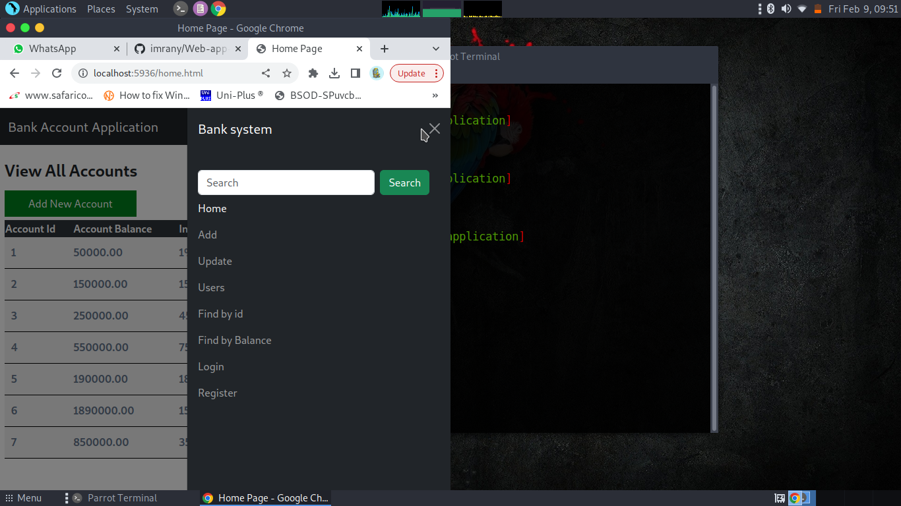

# Bank Application
This is a banking system that does the following tasks:
- Enables users to create new account
- Enable users to update their account details
- Enable users to access their banking details through Login
- Enable users to view a table of their balance
- Find their bank details by balance.
- Find their bank details by ID.
- View other user details.

## Home page
This is the [Home.html](./home.html). This page contains a table with a list of accounts with their properties.

## Login page
This is the [Login.html](./login.html). This page contains a form that enables users to log into the system and access their accounts.

## Register page
This is the [Register.html](./register.html). This page contains a form that enables users to create accounts.

## Add page
This is the [Add.html](./newAccount.html). This page contains a form that enables users to add new accounts into the system.

## Find by Balance and Find By ID
These two pages are use to retrieve user details using account balance or their account ID.

## Users page
This page contains a list of all registered users in this system.
 

# Responsiveness
This is website is also responsive in different screen sizes.

