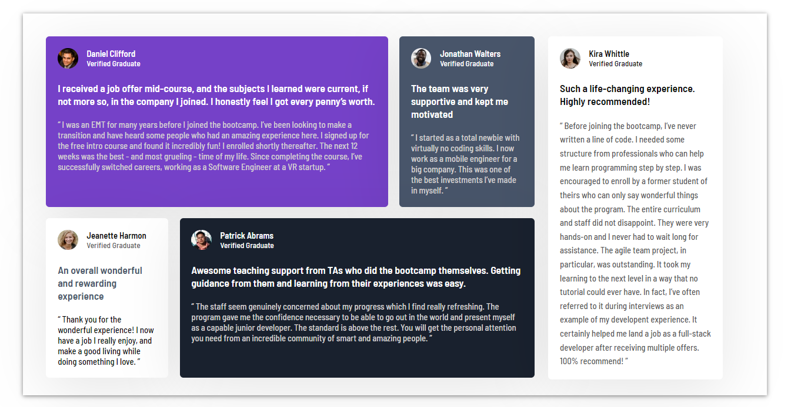

## Table of contents

- [Overview](#overview)
  - [Links](#links)
- [My process](#my-process)
  - [Built with](#built-with)
- [Author](#author)

## Overview

### Links

- [Solution URL](https://www.frontendmentor.io/solutions/responsive-testimonials-page-using-css-grid-IjqnxFPY7m)
- [Live Site URL](https://testimonial-grid-page.netlify.app/)

## My process

### Built with

- Semantic HTML5 markup
- CSS custom properties
- Flexbox
- CSS Grid
- Mobile-first workflow

## Author

- Website - [Blackshark](https://testimonial-grid-page.netlify.app/)
- Frontend Mentor - [@Giathi-Daniel](https://www.frontendmentor.io/profile/@Giathi-Daniel)
