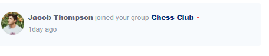
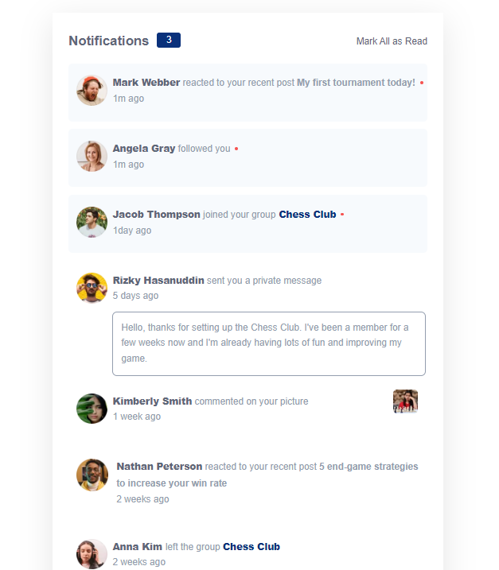
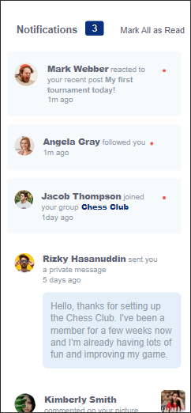

# Frontend Mentor - Notifications page solution

This is a solution to the [Notifications page challenge on Frontend Mentor](https://www.frontendmentor.io/challenges/notifications-page-DqK5QAmKbC). Frontend Mentor challenges help you improve your coding skills by building realistic projects.

## Table of contents

- [Overview](#overview)
  - [The challenge](#the-challenge)
  - [Screenshot](#screenshot)
  - [Links](#links)
- [My process](#my-process)
  - [Built with](#built-with)
  - [What I learned](#what-i-learned)
- [Author](#author)

## Overview

### The challenge

Users should be able to:

- Distinguish between "unread" and "read" notifications
- Select "Mark all as read" to toggle the visual state of the unread notifications and set the number of unread messages to zero
- View the optimal layout for the interface depending on their device's screen size
- See hover and focus states for all interactive elements on the page

### Screenshot







### Links

- Solution URL: [Sln-url](https://your-solution-url.com)
- Live Site URL: [Live-url](https://notifypage.netlify.app/)

## My process

### Built with

- Semantic HTML5 markup
- CSS custom properties
- Flexbox
- CSS Grid

### What I learned

I learnt the difference between .querySelectorAll and .querySelector DOM elements

```JS
document.querySelectorAll('.read')
document.querySelector('.mark')
```

I also revisited about textContent and innerHTML

```JS
msg.textContent = "0"
msg.innerHTML = "No messages found"
```

To see how you can add code snippets, see below:

## Author

- Website - [BLACKSHARK](https://www.your-site.com)
- Frontend Mentor - [Giathi-Daniel](https://www.frontendmentor.io/profile/Giathi-Daniel)
