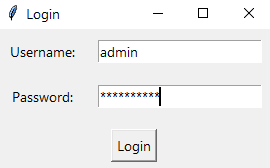
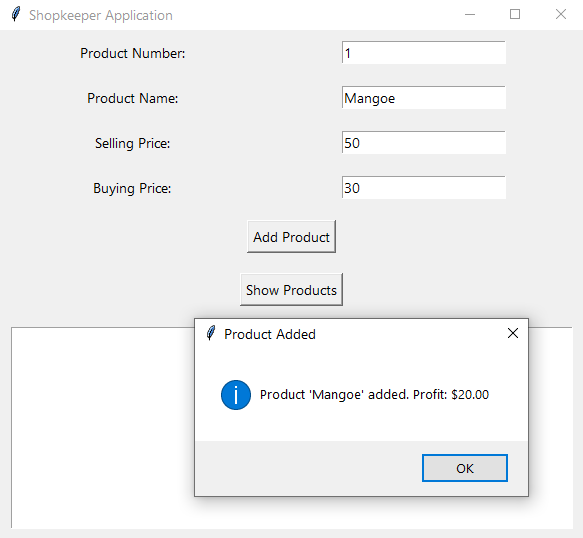
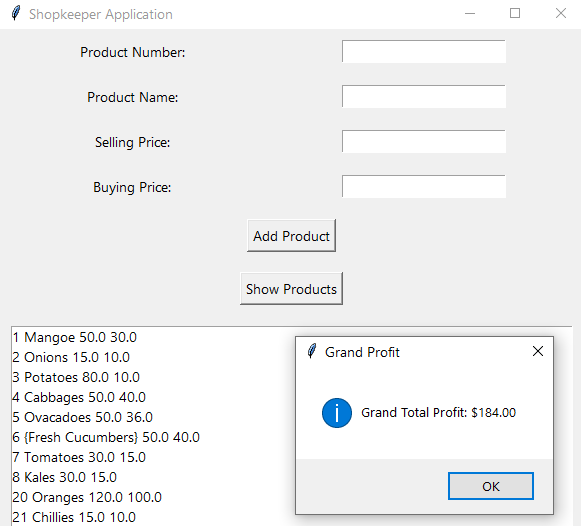

# Requirements for Shopkeeper Application
    - Login Functionality:
        Create a login form where the user enters a username and password.
        Only allow access if the entered credentials match predefined values (e.g., username: "admin", password: "shopkeeper").
    - Main Application Window:
        After successful login, open a main window for the shopkeeper application.
        Include fields to enter details for adding a product:
        Product Number (product_num)
        Product Name (product_name)
        Selling Price (selling_price)
        Buying Price (buying_price)
    - Product Management:
        Provide a button to add the entered product details to a database table named products.
        Calculate and display the profit made for each product after selling, based on the selling price minus the buying price.
    - Display Products and Profit:
        Include functionality to display all products stored in the database (products table) along with their respective profits.
    - Display should show:
        Product details (product number, name, selling price, buying price).
        Profit calculated for each product.
    - Database Interaction:
        Use MySQL database (shopkeeper) to store and retrieve product information.
        Ensure the database table (products) has appropriate columns (product_num, product_name, selling_price, buying_price) to store product details.

# Step-by-Step Implementation
   *Imports and Database Connection Setup*
    Import necessary modules (mysql.connector for database interaction, tkinter for GUI, and messagebox for displaying messages).
    Establish a connection to your MySQL database.
    *Login Form*
    Create a login window using tkinter.
    Implement authentication logic to verify username and password.
    *Main Application Window*
    Upon successful login, open the main application window.
    Include entry fields for product details (product_num, product_name, selling_price, buying_price).
    Buttons to add products, calculate profit, and display products.
    *Database Operations*
    Insert products into the database.
    Calculate profit for each product.
    Display products and their profits.

