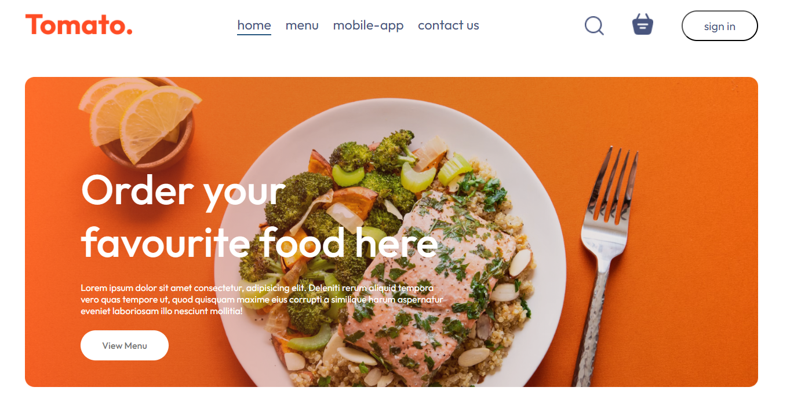

# React + Vite

A fullstack Modern foodwebsite with both fronted for customers view, purchase and login, and a backend part for admin inspection (add, delete and update features) as well as order checkup and updates.

#Startup

```
npm create vite@latest
```

#installing router-dom for react

```
npm install react-router-dom
```

#run your project live

```
npm run dev
```

Currently, two official plugins are available:

- [@vitejs/plugin-react](https://github.com/vitejs/vite-plugin-react/blob/main/packages/plugin-react/README.md) uses [Babel](https://babeljs.io/) for Fast Refresh
- [@vitejs/plugin-react-swc](https://github.com/vitejs/vite-plugin-react-swc) uses [SWC](https://swc.rs/) for Fast Refresh



[Visit the live project here](https://frontendfoodwebsite.netlify.app/)
